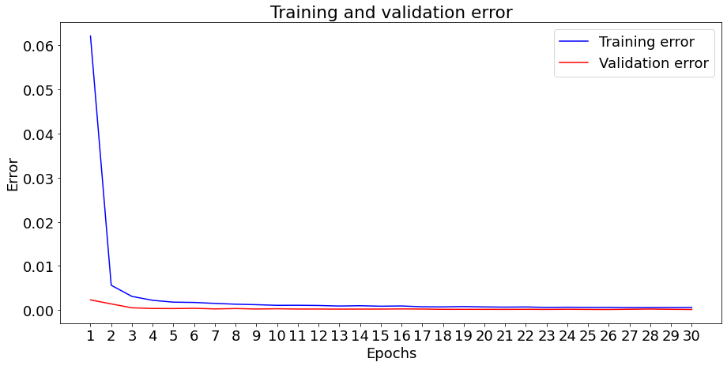

# LSTM-based-method-forPredicting-stock

* lstm是什么：
  * 时序模型
  * lstm优缺点
* 为什么用于股票预测（研究目标，研究内容）
* 数据集介绍
* 数据预处理
* 模型介绍（三个）
* 结果比较

## 为什么需要时间序列模型？

您想正确地模拟股票价格，因此作为股票购买者，您可以合理地决定何时购买股票以及何时出售股票以获利。 这就是时间序列建模的用武之地。您需要良好的机器学习模型，这些模型可以查看数据序列的历史记录并正确预测序列的未来元素。

但是股市价格非常难以预测且波动很大。这意味着数据中没有一致的模式可以让您近乎完美地模拟一段时间内的股票价格。普林斯顿大学的经济学家伯顿·马尔基尔在其1973年的著作《华尔街的随机漫步》中指出，如果市场真正有效，并且股价能立即反映出所有因素，当它们被公开时，被蒙住眼睛的猴子向报纸股票上市投掷飞镖应该和任何投资专家一样。

但是，我们不要一味认为这只是一个随机或随机的过程，并且对于机器学习没有希望。让我们看看是否至少可以对数据建模，以便您做出的预测与数据的实际行为相关。换句话说，您不需要确切的未来股票价值，而需要股票价格的变动（即如果近期内下跌的趋势会上升）。

### lstm介绍

参考如下：http://colah.github.io/posts/2015-08-Understanding-LSTMs/

## 数据集介绍

数据集来源于https://www.kaggle.com/borismarjanovic/price-volume-data-for-all-us-stocks-etfs 该数据集提供了在纽约证券交易所，纳斯达克和纽约证券交易所MKT上交易的所有美国股票和ETF的完整历史每日价格和交易量数据。 它是您可以获得的同类最佳数据集之一。

数据以CSV格式保存，包含一下六个属性：

* Open: 当日开盘价
* Close: 当日收盘价
* High：当日最高股价
* Low: 当日最高股价
* Volume：股票成交量
* OpenInt：未平仓量

我们读取了惠普的股票数据

|    Date    |  Open   |  High   |   Low   |  Close  |
| :--------: | :-----: | :-----: | :-----: | :-----: |
| 1970-01-02 | 0.30627 | 0.30627 | 0.30627 | 0.30627 |
| 1970-01-05 | 0.30627 | 0.31768 | 0.30627 | 0.31385 |
| 1970-01-06 | 0.31385 | 0.31385 | 0.30996 | 0.30996 |
| 1970-01-07 | 0.31385 | 0.31385 | 0.31385 | 0.31385 |
| 1970-01-08 | 0.31385 | 0.31768 | 0.31385 | 0.31385 |

该图已经说明了很多事情。 我之所以选择这家公司而不是其他公司，原因是该图随着时间的推移出现了不同的股价行为。 这将使学习变得更加强大，并给您带来变化，以测试各种情况下的预测效果如何。

还要注意的另一件事是，接近2017年的价值比接近1970年代的价值高得多，并且波动更大。 因此，您需要确保数据在整个时间范围内的行为在相似的值范围内。 在数据规范化阶段，您将处理此问题。

### 数据预处理

### 将数据分为训练集和测试集

您将使用通过计算一天中最高和最低记录价格的平均值计算出的平均价格。使用平均价格代表当前时间的股票价格。将时间序列的前11,000个数据点划分位训练集，其余的将是测试数据，这样，训练集和测试集比例约为4：1。

### 归一化

根据论文《A LSTM-based method for stock returns prediction   A case study of China stock market 》，将数据进行归一化处理后，对于提高准确性非常有用。我们将数据进行归一化。

根据之前的观察，数据的不同时间段具有不同的值范围，股价在前期值域在0到0.5之间，而后期值域在5到30之间，因此我们将整个序列划分为多个窗口并分别对数据进行归一化。 如果不这样做，则较早的数据将接近0，后期数据将趋近与1，并且不会为学习过程增加太多价值。 在这里，您选择的窗口大小为2500，可以将数据划分位5段。不过这将影响4个数据点。 但是，如果您有11,000个数据点，那么4点不会有任何问题。

## 评价指标

MSE-均方误差，copy一下算法啥的，

MSE的值越小，说明预测模型描述实验数据具有更好的精确度

## 使用平均机制来预测股票

过去市场上常常使平均机制来预测股票，即用通过先前观察到的股票价格的平均值来预测未来股票价格。这样做超过一个时间步可能会产生非常糟糕的结果。 您将在下面查看两种平均技术。 标准平均和指数移动平均线。

### 标准平均

首先，我们将尝试预测未来的股票价格（例如：$x_{t+1}$)，将固定大小的时间窗口（例如：$x_{t-N}$,$\cdots$,$x_t$）内的股票价格作为我们预测的价格。
$$
x_{t+1}=1/N\sum_{i=t-N}^tx_i
$$
换句话说，您说在t + 1的预测是您在t到t-N的窗口内观察到的所有股票价格的平均值。

下图位标准平均的预测结果。标准平均值的MSE误差：0.00487。它非常接近股票的实际行为。接下来，您将看到一种更准确的预测方法。

### 指数移动平均

在指数移动平均法中，我们将如下计算$x_{t+1}$:

$$
x_{t+1} = EMA_t =γ×EMA_{t-1} +（1-γ）x_t 
其中 EMA0 = 0，并且EMA是随时间保持的指数移动平均。
$$

$$
EMA=\frac {p_1+(1-\alpha)P_2+(1-\alpha)^2P_3+(1-\alpha)+\cdots}{1+(1-\alpha)+(1-\alpha)^2+(1-\alpha)^3+\cdots}
$$

上面的等式基本上从t + 1个时间步开始计算指数移动平均值，并将其用作提前一步的预测。 γ决定最新预测对EMA的贡献。 例如，γ= 0.1仅将当前值的10％存入EMA。 由于您只使用了最新数据的一小部分，因此可以保留您在平均值中很早就看到的更旧的值。 

各数值的加权影响力随时间而指数式递减，越近期的数据加权影响力越重，但较旧的数据也给予一定的加权值。

下图位标准平均的预测结果，EMA平均的MSE错误：0.00019。

### 这两种模型的局限性

实际上，仅凭第二天的股票市值就无法做很多事情。 我个人想要的不是第二天的确切股市价格，而是未来30天的股市价格会上涨还是下跌。 尝试执行此操作，您将发现EMA方法的功能不足。

## LSTM模型

长短期记忆模型是功能非常强大的时间序列模型。 他们可以预测未来的任意数量的步骤。 LSTM模块（或单元）具有5个基本组件，可用来对长期和短期数据进行建模。

### 数据生成

为了使模型健壮，我们预测$x_{t-N}$,$\cdots$,$x_t$的时候，不会输出$x_{t+1}$,而是从($x_{t+1}, \cdots, x_{t+M}$)中随机取一个值，其中，M为一个不大的数。

### 模型建立

三层lstm模型如下

### 结果

### 模型2

根据论文《Time-weighted LSTM Model with Redefined Labeling for Stock Trend Prediction》抄一大堆上去

原始数据

技术趋势后

训练loss值

训练error值

预测结果

### 模型3

参考论文《Share Price Trend Prediction Using CRNN with LSTM Structure》

### 模型4 

结合前连个模型

